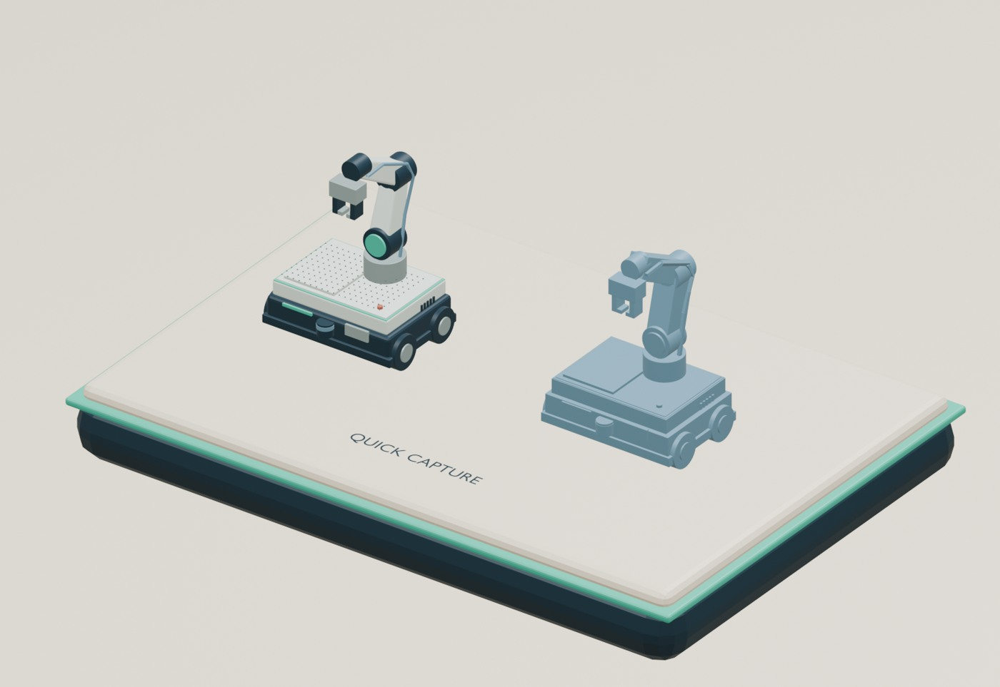

# FAB Scene Kit

Blender에서 일관된 스타일의 반도체 FAB 인포그래픽을 조립하는 애드온입니다.

**현재 버전: 0.4.2 · 검증 환경: Blender 4.3.0 · 기본 52개 에셋 · 3개 템플릿 + 로컬 에셋 작성**

## Guided Brief — 실제 애드온 5단계 마법사

**N → FAB Author → Guided Brief**에서 복잡한 원본 hierarchy를 바꾸지 않고 대상 지정 → 구성 설명 → 주요 부품 연결 → 측정·관계 → 1000자 검토를 수행합니다. **0.4.2에 구현되어 ZIP으로 설치할 수 있습니다.**

- Workspace 등 보조 객체를 직접 Keep / Exclude하고 포함 범위를 확정합니다.
- AMMR / AMR / Robot arm / Equipment / Humanoid / OHT, 외형, 팔 수·축 수와 추가 기구를 선택합니다.
- 주요 부품만 Selected Only / Include Children으로 연결합니다. 나머지는 Describe Only로 설명할 수 있습니다.
- 전체·부품 크기와 중심을 현재 pose에서 선택적으로 측정합니다. 단위·방향·원본 변경 시 갱신합니다.
- AW1 설명 텍스트를 **전체 1000자 이하**로 복사·내보냅니다. 초과한 내용은 자동 삭제하지 않습니다.

[실제 화면 5장이 포함된 HTML 튜토리얼 다운로드](https://github.com/bshwang/fab_design/raw/refs/heads/main/dist/FAB_Guided_Brief_Manual_0.4.2_KO.html) · [텍스트 사용 안내](docs/GUIDED_BRIEF_KO.md) · [AW1 형식](docs/GUIDED_BRIEF_SCHEMA.md) · [543자 합성 예제](dist/FAB_Guided_Brief_Example_0.4.2.txt)

AW1은 모델링을 위한 구조·역할 설명입니다. 텍스트만으로 완성 에셋을 자동 생성하지 않습니다. 완성된 FAB Author 에셋은 기존 Local Library로 가져옵니다. Quick Capture와 Advanced도 같은 FAB Author 탭에 유지됩니다.

[이전 설계 문서](docs/design/AUTHOR_WIZARD_DESIGN_v1_KO.md)와 [독립 HTML 설계 데모](docs/design/author-wizard-v1.html)는 참고용입니다. 설치된 화면과 사용법은 위의 0.4.2 매뉴얼을 따르세요. [Object hierarchy 추출 스크립트](docs/HIERARCHY_EXPORT_KO.md)도 사용할 수 있습니다.


## 다운로드와 설치

1. [애드온 ZIP 다운로드](https://github.com/bshwang/fab_design/raw/refs/heads/main/dist/fab_scene_kit-0.4.2.zip)
2. Blender에서 **Edit → Preferences → Add-ons → 메뉴 → Install from Disk**를 엽니다.
3. 다운로드한 `fab_scene_kit-0.4.2.zip`을 선택하고 **FAB Scene Kit**을 활성화합니다. ZIP은 풀지 않습니다.
업데이트 전 작업을 저장하고, 설치 후 Blender를 재시작하세요. 로컬 라이브러리는 애드온 설치 폴더 밖에 보관합니다.

4. 3D Viewport에서 **N → FAB Kit**을 엽니다.
5. **FAB Example → Light 또는 Dark → Create New Scene**으로 시작합니다.

모델·재질·템플릿이 ZIP에 포함되어 있습니다. 추가 Python 패키지나 네트워크 연결 없이 실행합니다. GitHub의 **Code → Download ZIP**은 저장소 전체를 받는 기능입니다. Blender에 직접 설치할 파일은 위의 애드온 ZIP입니다.

- [FAB Author 0.4.0 화면 매뉴얼 HTML 다운로드](https://github.com/bshwang/fab_design/raw/refs/heads/main/dist/FAB_Scene_Kit_Author_Manual_0.4.0_KO.html)
- [기존 장면 조립 매뉴얼 HTML 다운로드](https://github.com/bshwang/fab_design/raw/refs/heads/main/dist/FAB_Scene_Kit_User_Manual_0.3.0_KO.html)
- [빠른 사용법](docs/QUICKSTART_KO.md)
- [전체 HTML 카탈로그 다운로드](https://github.com/bshwang/fab_design/raw/refs/heads/main/dist/FAB_Scene_Kit_Asset_Catalog_0.3.0.html)
- [다운로드 파일 SHA-256](dist/SHA256SUMS.txt)
- [버전 변경 사항](CHANGELOG.md)

HTML 카탈로그는 **다운로드 후 브라우저에서 여세요**. 이미지가 내장된 단일 파일이며, 검색·분류·상세 보기·선택 목록 CSV·인쇄/PDF 기능을 제공합니다. GitHub 파일 화면에서는 HTML 코드가 표시됩니다.

사용자 매뉴얼도 이미지가 내장된 단일 HTML입니다. 실제 Blender 화면 11장과 렌더 3장을 포함하고, 설치 → 템플릿 → 검사 셀 조립 → Cleanroom 편집 → 사람 포즈 교체 → 라벨·OHT → PNG·`.blend` 저장을 설명합니다. 화면 확대, 목차 검색, 실습 체크리스트를 제공합니다. **다운로드한 HTML 파일 하나만** 옮기면 오프라인에서 본문과 그림을 읽을 수 있습니다.

## Quick Capture — 1000자 형상 전달

**N → FAB Author → Quick Capture**에서 전체 모델 선택 → Type / Key features 입력 → Capture Selection → 파란 형상 가이드 확인 → Copy Text (1000 max) 순서로 사용합니다. 별도 N 탭은 추가되지 않습니다. 기존 부품별 입력은 FAB Author의 **Advanced**에서 계속 사용할 수 있습니다.

- [실제 화면이 포함된 Quick Capture HTML 매뉴얼](https://github.com/bshwang/fab_design/raw/refs/heads/main/dist/FAB_Quick_Capture_Manual_0.4.1_KO.html)
- [짧은 사용 안내](docs/QUICK_CAPTURE_KO.md) · [FQ1 텍스트 형식](docs/QUICK_SCHEMA.md)
- [938자 합성 AMMR 예제](dist/FAB_Quick_Capture_Example_0.4.1.txt)



타입·특징·전체 치수와 주요 형상의 위치·크기·방향을 1000자 이내 텍스트로 요약합니다. 받은 쪽에서는 Paste Quick Text + Preview로 형상을 확인한 뒤 FAB 스타일의 최종 모델로 발전시킵니다. 파란 가이드는 형상 요약이며 자동으로 완성된 에셋을 뜻하지 않습니다. 중요한 얇은 부품·창·구멍 등은 특징에 적고, 캡처 후 단위와 방향을 확인하세요. 네트워크 없이 실행하며 직접 복사/저장할 때만 텍스트를 내보냅니다.

## 포함 기능

**Advanced: N → FAB Author → Advanced**에서 모델 정보를 텍스트로 작성하고 재사용 에셋으로 등록합니다.

1. Equipment / AMR / AMMR / Robot Arm / Humanoid / OHT 타입과 기준 축·단위를 설정합니다.
2. 원본 부품을 선택해 치수·위치·회전을 측정합니다. 단면, 파이프·케이블 경로와 관절 중심·축도 기록합니다.
3. JSON을 export/import하거나 클립보드로 왕복하고, 명세만으로 FAB 스타일 프리뷰를 생성합니다.
4. 별도 로컬 라이브러리에 썸네일과 함께 저장하거나, 반환된 개별 FAB Author `.blend`를 import합니다. FAB Kit와 Asset Browser에서 조립합니다.

[단계별 작성 안내](docs/AUTHOR_GUIDE_KO.md) · [텍스트 schema](docs/AUTHOR_SCHEMA.md) · [공개 연습용 AMMR JSON](dist/FAB_Author_AMMR_Example_0.4.0.json) · [개별 에셋 .blend 다운로드](https://github.com/bshwang/fab_design/raw/refs/heads/main/dist/FAB_Author_AMMR_Example_0.4.0.blend)


기본 52개 모델과 템플릿은 0.3.0 라이브러리를 유지합니다. 로컬 라이브러리는 설치 폴더 밖에 두고 별도로 보관합니다. 업데이트하면 이전에 배치한 에셋은 유지됩니다.

| 분류 | 항목 수 |
| --- | ---: |
| Manufacturing | 9 |
| Utilities | 11 |
| Robots | 7 |
| People | 6 |
| Logistics & OHT | 10 |
| Space | 5 |
| Connections | 4 |

- **Blank Stage / FAB Overview / FAB Example** 템플릿과 Light/Dark 테마
- 버튼 또는 Asset Browser로 모델 배치, 복제·정렬·회전·모델/포즈 교체
- Cleanroom 바닥·벽 개별 편집, 사용자 라벨·장면 제목 편집
- OHT 레일 조립, isometric 카메라, PNG 렌더와 `.blend` 저장


0.3.0은 검사·실험실 장비 및 소품 9종과 사람 자세 4종을 추가하고 기존 사람 2종을 성인 비율로 개정했습니다.


## 범위

정적인 설명용 장면 제작을 위한 모델과 도구입니다. FAB Author는 사용자가 역할과 표현 형상을 지정하는 측정·모델 생성 도구입니다. 복잡한 CAD의 자동 스타일 변환, 관절 rig/애니메이션, 물류 시뮬레이션은 포함하지 않습니다. 여섯 가지 형상과 단면·경로로 중요한 외형을 기술하고 프리뷰로 확인합니다. 장비는 특정 제조사의 인증 모델이 아닙니다.

## 저장소 구성

```text
addon/fab_scene_kit/   설치 패키지와 일치하는 소스·모델·템플릿
dist/                 설치 ZIP·HTML 카탈로그·화면 매뉴얼·체크섬
docs/                 사용법·장면 예시·검증 범위
tools/                패키지 재생성·무결성 검사
```

개발 환경에 Python 3.11 이상이 있으면 다음 명령으로 배포본의 체크섬, 전체 패키지 파일, 52개 기본 에셋과 내장 이미지를 검사할 수 있습니다. 일반 설치·사용에는 필요하지 않습니다.

```powershell
python tools/verify_package.py
```

소스를 수정한 후 `python tools/package.py`로 ZIP을 다시 만들 수 있습니다. 새 배포 전에는 Blender에서 설치·배치·렌더·저장을 다시 확인하십시오. [검증 범위](docs/VALIDATION.md)를 참고하세요.

개발자용 Guided Brief 재현 검사는 `tools/test_guided_brief.py`에 있습니다. Blender `--background --factory-startup --python-exit-code 1 --python tools/test_guided_brief.py`로 합성 모델에서 실행합니다. 실제 ZIP 검사에는 `-- --installed`를 추가하고, `BLENDER_USER_CONFIG`를 저장소 안의 **미리 생성한** `docs/testing/config` 폴더로 지정하세요. 사용자 Blender 프로세스와 분리된 테스트 프로필을 사용합니다. 검사 산출물은 `docs/testing`에 저장됩니다.

애드온 Python 코드의 라이선스는 [GPL-3.0-or-later](LICENSE.txt)입니다. 모델과 렌더에 관한 별도 설명은 [ASSET_LICENSE.txt](ASSET_LICENSE.txt)를 참고하세요.
