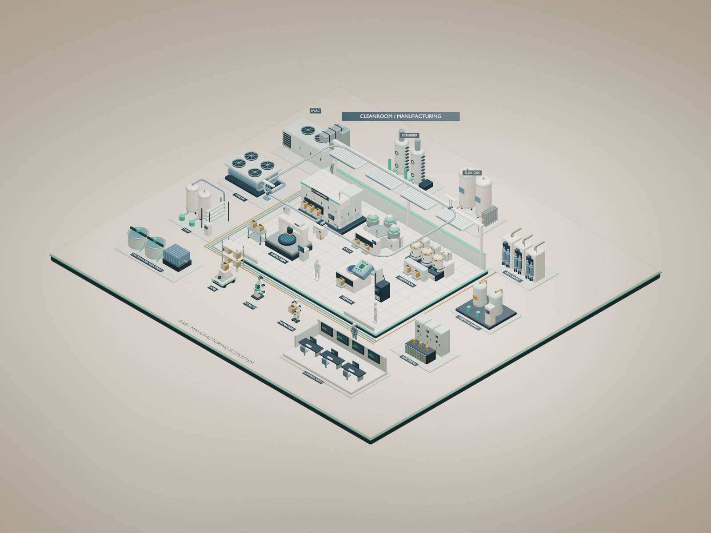
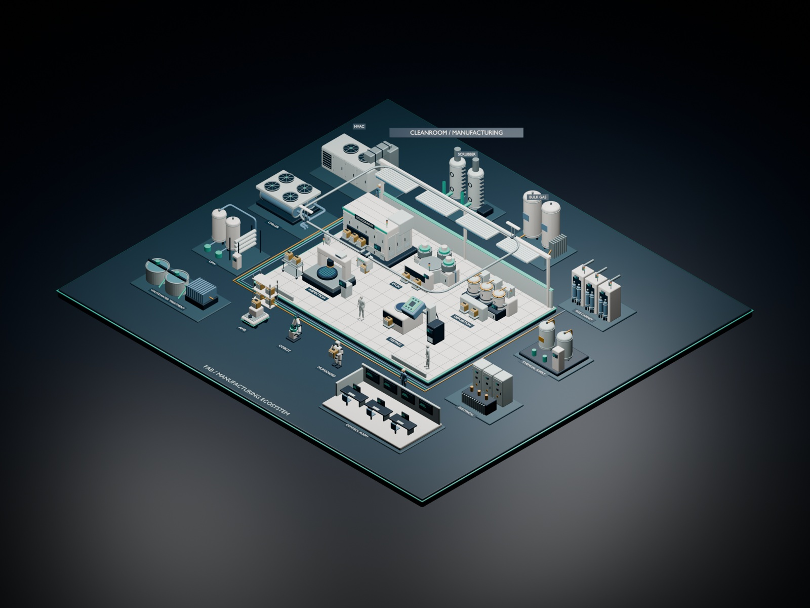
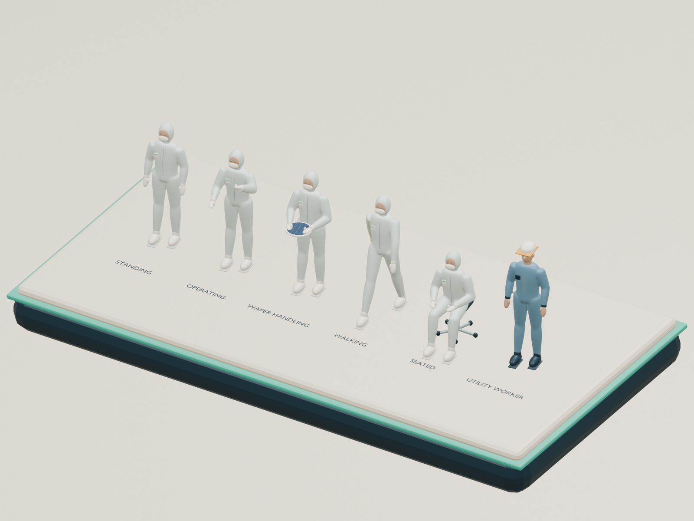

# FAB Scene Kit

Blender에서 일관된 스타일의 반도체 FAB 인포그래픽을 조립하는 애드온입니다.

**현재 버전: 0.3.0 · 검증 환경: Blender 4.3.0 · 52개 에셋 · 3개 템플릿**



## 다운로드와 설치

1. [애드온 ZIP 다운로드](https://github.com/bshwang/fab_design/raw/refs/heads/main/dist/fab_scene_kit-0.3.0.zip)
2. Blender에서 **Edit → Preferences → Add-ons → 메뉴 → Install from Disk**를 엽니다.
3. 다운로드한 `fab_scene_kit-0.3.0.zip`을 선택하고 **FAB Scene Kit**을 활성화합니다. ZIP은 풀지 않습니다.
4. 3D Viewport에서 **N → FAB Kit**을 엽니다.
5. **FAB Example → Light 또는 Dark → Create New Scene**으로 시작합니다.

모델·재질·템플릿이 ZIP에 포함되어 있습니다. 추가 Python 패키지나 네트워크 연결 없이 실행합니다. GitHub의 **Code → Download ZIP**은 저장소 전체를 받는 기능입니다. Blender에 직접 설치할 파일은 위의 애드온 ZIP입니다.

- [스크린샷 사용자 매뉴얼 HTML 다운로드](https://github.com/bshwang/fab_design/raw/refs/heads/main/dist/FAB_Scene_Kit_User_Manual_0.3.0_KO.html)
- [빠른 사용법](docs/QUICKSTART_KO.md)
- [전체 HTML 카탈로그 다운로드](https://github.com/bshwang/fab_design/raw/refs/heads/main/dist/FAB_Scene_Kit_Asset_Catalog_0.3.0.html)
- [다운로드 파일 SHA-256](dist/SHA256SUMS.txt)
- [버전 변경 사항](CHANGELOG.md)

HTML 카탈로그는 **다운로드 후 브라우저에서 여세요**. 이미지가 내장된 단일 파일이며, 검색·분류·상세 보기·선택 목록 CSV·인쇄/PDF 기능을 제공합니다. GitHub 파일 화면에서는 HTML 코드가 표시됩니다.

사용자 매뉴얼도 이미지가 내장된 단일 HTML입니다. 실제 Blender 화면 11장과 렌더 3장을 포함하고, 설치 → 템플릿 → 검사 셀 조립 → Cleanroom 편집 → 사람 포즈 교체 → 라벨·OHT → PNG·`.blend` 저장을 설명합니다. 화면 확대, 목차 검색, 실습 체크리스트를 제공합니다. **다운로드한 HTML 파일 하나만** 옮기면 오프라인에서 본문과 그림을 읽을 수 있습니다.

## 포함 기능

| 분류 | 항목 수 |
| --- | ---: |
| Manufacturing | 9 |
| Utilities | 11 |
| Robots | 7 |
| People | 6 |
| Logistics & OHT | 10 |
| Space | 5 |
| Connections | 4 |

- **Blank Stage / FAB Overview / FAB Example** 템플릿과 Light/Dark 테마
- 버튼 또는 Asset Browser로 모델 배치, 복제·정렬·회전·모델/포즈 교체
- Cleanroom 바닥·벽 개별 편집, 사용자 라벨·장면 제목 편집
- OHT 레일 조립, isometric 카메라, PNG 렌더와 `.blend` 저장



0.3.0은 검사·실험실 장비 및 소품 9종과 사람 자세 4종을 추가하고 기존 사람 2종을 성인 비율로 개정했습니다.



## 범위

정적인 설명용 장면 제작을 위한 모델과 도구입니다. 사람·로봇은 고정 포즈이며 상세 CAD 변환, 로봇 애니메이션, 물류 시뮬레이션은 포함하지 않습니다. 장비는 특정 제조사의 정밀 설계나 인증 모델이 아닙니다.

## 저장소 구성

```text
addon/fab_scene_kit/   설치 패키지와 일치하는 소스·모델·템플릿
dist/                 설치 ZIP·HTML 카탈로그·화면 매뉴얼·체크섬
docs/                 사용법·장면 예시·검증 범위
tools/                패키지 재생성·무결성 검사
```

개발 환경에 Python 3.11 이상이 있으면 다음 명령으로 배포본의 체크섬, 65개 패키지 파일, 52개 에셋과 내장 이미지를 검사할 수 있습니다. 일반 설치·사용에는 필요하지 않습니다.

```powershell
python tools/verify_package.py
```

소스를 수정한 후 `python tools/package.py`로 ZIP을 다시 만들 수 있습니다. 새 배포 전에는 Blender에서 설치·배치·렌더·저장을 다시 확인하십시오. [검증 범위](docs/VALIDATION.md)를 참고하세요.

애드온 Python 코드의 라이선스는 [GPL-3.0-or-later](LICENSE.txt)입니다. 모델과 렌더에 관한 별도 설명은 [ASSET_LICENSE.txt](ASSET_LICENSE.txt)를 참고하세요.
